## Hello👋

I'm Adam- Full-Stack Developer at [Acoustic](https://www.acoustic.com/product/acoustic-connect), building a cloud-native customer engagement platform with TypeScript, React & NestJS.

Previously at Carrier (LenelS2) - developing cloud-based access control SaaS on Azure.

After hours I build personal tools for myself - from bank API integrations to a training app connected to my Garmin watch.

### Tech Stack

---

### Early Projects (CodersCamp 2021–2022)

Team projects built during my career transition from civil engineering to software development. [CodersCamp](https://coderscamp.pl/) was Poland's largest open-source web dev bootcamp (non-profit, by CodersCrew & LiveChat) - 6 modules, each ending with a team project in SCRUM. Built with my team [*DevsOnTheWaves*](https://github.com/CC2021-WBL).

|Date|Project|Description|Screen|Repository|Technologies|
|---|---|---|---|---|---|
|12.2021|Harry Potter Quiz Game|Guess the character from Harry Potter’s World||[repo](https://github.com/CC2021-WBL/Project-I)|VanillaJS, SASS, BEM, Parcel|
|01-03.2022|GOOD Boi Application|App for Dog Obedience Championship competitors||[repo](https://github.com/CC2021-WBL/GOOD-BOI-Application)|React, React Router v6, Context API, styled-components|
|04.2022|SPAralige|Booksy clone for SPA reservation||[repo](https://github.com/CC2021-WBL/SPAralige-by-Matylda-Borutka)|TypeScript, React, MUI, Formik, Firebase|
|05.2022|S.Mallets|Small e-shop with mallets||[repo](https://github.com/CC2021-WBL/S.Mallets-frontend)|TypeScript, React, Redux, Tailwind, i18n|
